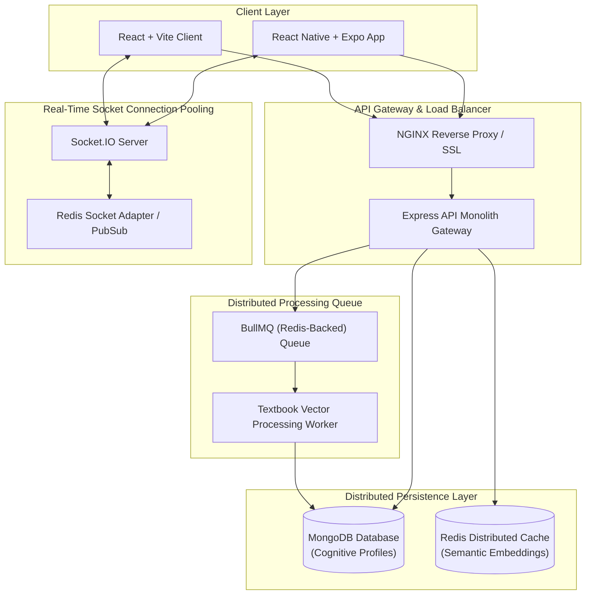
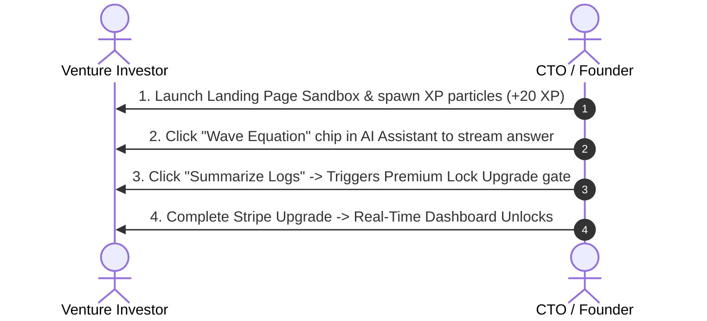

# ✨ Scholar: The Defensible AI-Native Academic Productivity Suite

> **YC-Style Pitch:** Scholar is the first synchronized, AI-native productivity ecosystem designed for top 1% students. We replace fragmented solo tools (Notion, rate-limited chatbots, standard timers) with real-time focus corridors, textbook vector similarity search, and automated active recall engines.

[](https://github.com/scholar/platform)
[](https://scholar.ai/api/health)
[](#yc-style-pitch-narrative)

---

## 🗺️ Part 1: Core System Architecture

Scholar is designed using a decoupled micro-architecture scaling seamlessly across web, mobile, and background processing workers.



---

## 📈 Part 2: Venture Pitch & Strategic Defensibility

### YC-Style Pitch Narrative
- **The Problem:** Modern academic focus is incredibly fragmented. Students switch between Notion for logs, generic timers for pacing, Discord for silent focus lounges, and rate-limited web browsers for AI search. Every context switch decays focus and leaks data.
- **The Solution:** Scholar combines synchronized, gamified Pomodoro focus corridors with deeply integrated, context-aware AI text-analysis tools. The AI assistant possesses long-term cognitive memory of uploaded textbooks, enabling students to search, study, auto-generate active recall materials, and chat directly within a single unified workspace.
- **Market Size (TAM):** $15B+ global educational productivity sector, targeting 220M+ university students scaling through organic, community-led campus loops.

### Technical Differentiation Positioning

| Capability / Layer | Scholar Platform | Generic Solo Apps |
| :--- | :--- | :--- |
| **Study Timers** | **Global Synced Corridors:** Multi-peer real-time presence with Socket.IO connection pooling. | **Solo Clocks:** Static client-side timers with no accountability hooks. |
| **AI Assistants** | **Cognitive Memory Engines:** Textbook PDF parsing, semantic vector search, long-term memory profiles. | **Browser Wrappers:** Zero local textbook ingestion, rate-limited third-party prompts. |
| **Resilience & Offline** | **Epoch Syncing & AsyncStorage Queue:** Background countdown preservation, offline-first mutations queue. | **Network Dependent:** Instant crash or timer freeze when internet connection drops. |
| **Gamification Loops** | **Dynamic XP Boosters & Streak Freezes:** Streak combustion engines, daily freeze cushions. | **Basic Stats:** Simple numeric counters with no anti-abuse safeguards. |

---

## ⚙️ Part 3: Scaling, Security & SRE Frameworks

### 1. Scaling Narrative
- **Distributed Lock Management:** Utilizes Redis Lua scripting to prevent concurrent database writes during multi-peer streak completions.
- **Sliding-Window Rate Limiting:** Enforces rate-limiting checks at the gateway layer to intercept suspicious requests before they burden processing queues.
- **Textbook Embedding Pipelines:** bullMQ orchestrates textbook chunk vector generation asynchronously outside critical loops, shielding UI thread responsiveness.

### 2. SRE & Reliability Summary
- **Prometheus Telemetry:** Exposes `/metrics` containing total HTTP requests, latencies, and BullMQ task pending counters.
- **Structured Health Probes:** Exposes K8s-compliant `/api/health`, `/api/health/liveness`, and `/api/health/readiness` probes returning precise standalone database connectivity flags.
- **Audit Trails:** Tracks high-compute premium operations in an audit registry for billing verification.

### 3. Monetization Overview
- **Conversion Gating:** Deep text summarization, formula solving, and textbook chunking require a **Cognitive Elite Pro** subscription.
- **Automatic Reconciliation:** Automatically reconciles subscription actions through Stripe Webhook events.

---

## 🛠️ Part 4: Developer Onboarding & DX Audit

This repository is optimized for quick, three-step onboarding of new contributors.

### 1. Developer Environments Setup (Local Sandbox)

#### Prerequisites
Ensure you have the following installed:
- Node.js (v18+)
- MongoDB (running locally or via Docker)
- Redis Server (running locally or via Docker)

#### Quickstart Guide
```bash
# Step 1: Clone the repository and install core dependencies
git clone https://github.com/scholar/platform.git
cd platform
npm install

# Step 2: Install client-side assets
cd client && npm install && cd ..

# Step 3: Run the local sandbox ecosystem in development mode
npm run dev:all
```

#### Verification Checks
Ensure everything is compiled cleanly:
```bash
# Run production build verification smoke test suite
npm test
```

### 2. Sandbox Environments Variables (.env)
Create a `.env` file in the root directory:
```env
PORT=5000
MONGODB_URI=mongodb://localhost:27017/scholar-dev
REDIS_URL=redis://localhost:6379
JWT_SECRET=supersecret_dev_jwt_token_scholar_platform
NODE_ENV=development
```

---

## 🎥 Part 5: Investor Demo Flow & Loom Walkthrough Plan

A high-converting 3-minute pitch demonstration flow for venture capitalists.

### 🎙️ Demo Script & Screen Flow



### 1. Step-by-Step Walkthrough Flow
1. **0:00 - 0:45: The Hook (Landing Page Sandbox)**
   - *"Watch this: I am a new student landing on Scholar. Immediately, I see a synchronized MIT Physics Room. If I click 'Boost Streak', golden XP particles stream up. I am earning XP before I even register. This is our core retention hook."*
2. **0:45 - 1:30: The Defensible Core (AI Textbook Engine)**
   - *"Now, I query our Gemini AI Companion on wave equations. The response streams live using SSE. Let's ask for the CS corridor summary: Boom. Upgrades pop-up. We block intensive processes behind an elegant payment wall."*
3. **1:30 - 2:30: The Real-Time Dashboard & Mobile**
   - *"Let's unlock the workspace: I simulate Stripe payment. Instantly, our real-time Socket.IO study room dashboard mounts. Over on the mobile Expo side, the offline-first todo synchronizer ensures students remain locked-in on the go."*
4. **2:30 - 3:00: Closing & Scale Metrics**
   - *"Under the hood, we are fully Dockerized, monitored by Prometheus, and ready to scale to 100k users. Scholar represents the absolute future of student study workflows."*

### 📸 Portfolio Screenshots Checklist
- [ ] **Slide 1:** Public Hero section featuring Headline A/B variation testing widgets.
- [ ] **Slide 2:** Interactive study room showcasing ticking clocks and real-time presence.
- [ ] **Slide 3:** The Premium AI Assistant showing the Stripe payment gateway lock overlay.
- [ ] **Slide 4:** Mobile Expo app showcasing glassmorphic onboarding.
- [ ] **Slide 5:** Prometheus Grafana dashboard displaying active connection counts and API latency.
